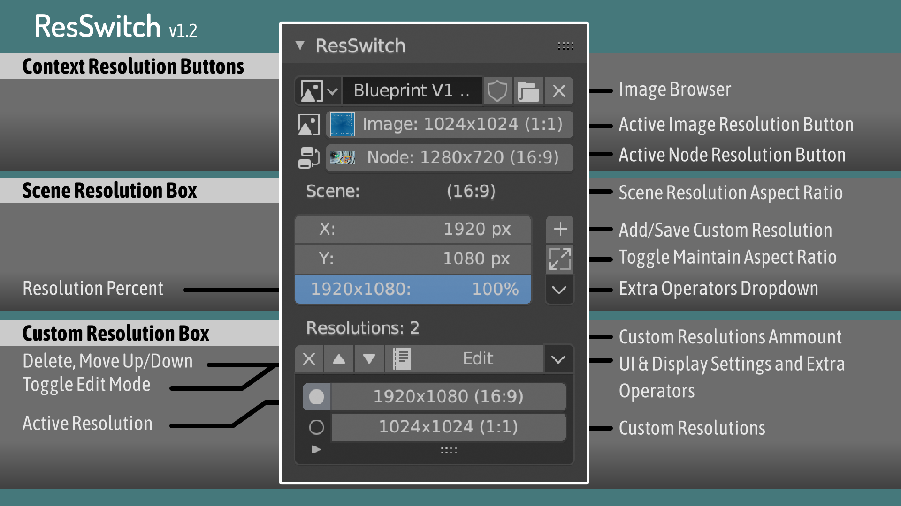
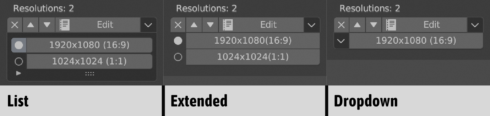
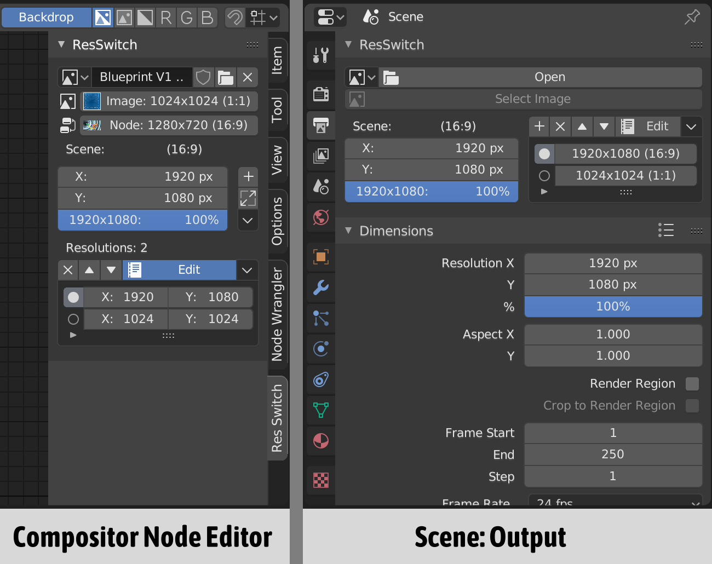

Title:   ResSwitch Documentation
Summary: ResSwitch Addon Documentation for Blender 2.79
Authors: JohnGDDR5 (Juan Cardenas)
Date:    July 16, 2019
blank-value:
some_url: https://example.com

!!! danger "Incomplete Documentation"
    Documentation hasn't been completely updated for ResSwitch v1.2 which updated the UI

#Panel Map

*ResSwitch v1.2 *

#Display Settings

*List, Extended & Dropdown mode*

The Display Mode of the Resolution Buttons can be changed in the Settings dropdown menu

#Panel Locations

*Panels in Compositor and Scene: Output*

#Change Resolutions

####Resolution Buttons

Click Resolution Buttons to change scene resolution

#Move ResButtons

*Move ResButton Positions*

