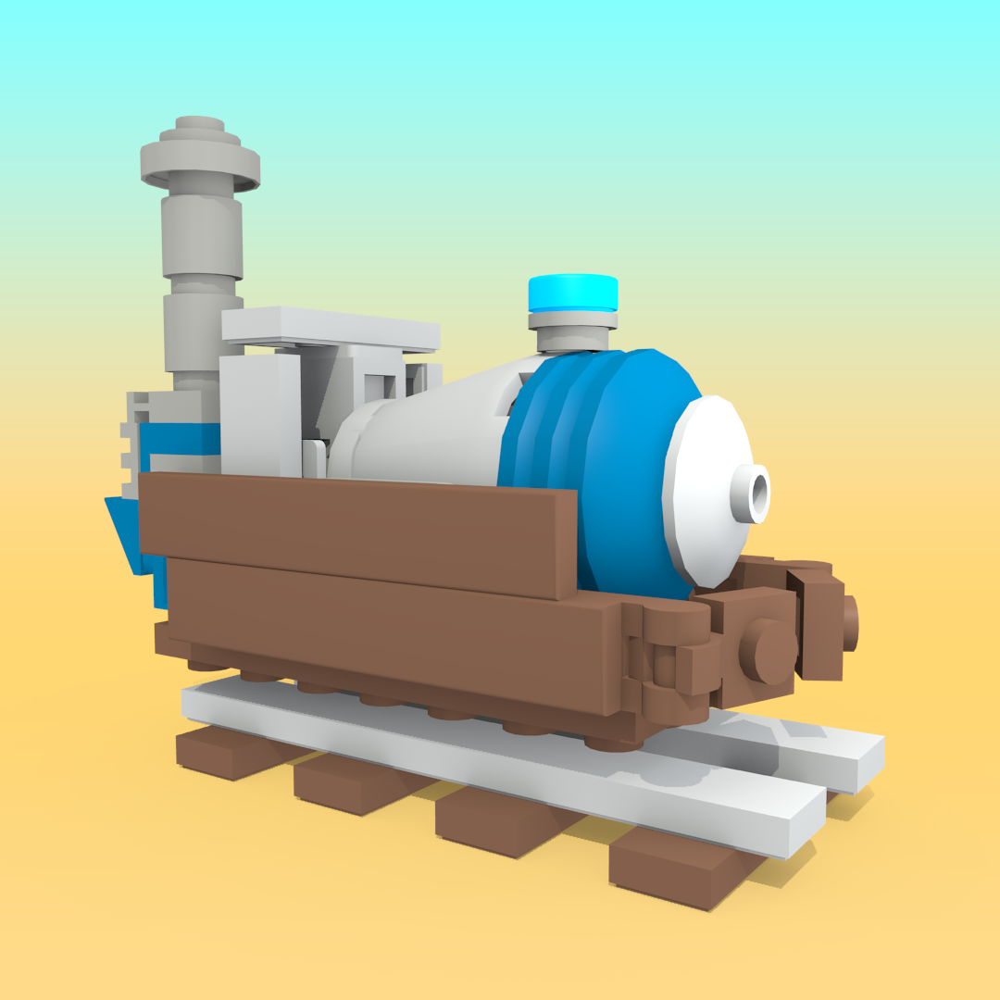
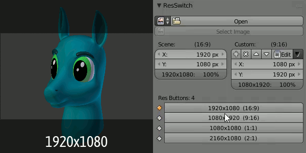

Title:   ResSwitch Documentation
Summary: ResSwitch Addon Documentation for Blender 2.79
Authors: JohnGDDR5 (Juan Cardenas)
Date:    July 16, 2019
blank-value:
some_url: https://example.com

# What is ResSwitch?

Buy RenderRig on: 
   **[BlenderMarket](https://blendermarket.com/products/resswitch), [Gumroad](https://gumroad.com/l/pMwIc), [Artstation](https://www.artstation.com/johngddr5/store/kvRB/resswitch-addon)** 
JohnGDDR5 on: 
   ** [Youtube](https://www.youtube.com/channel/UCzPZvV24AXpOBEQWK4HWXIA), [Twitter](https://twitter.com/JohnGDDR5), [Artstation](https://www.artstation.com/johngddr5)**

---

<!-- 

<iframe width="560" height="315" src="https://www.youtube.com/embed/XGg6JjMiyKo" frameborder="0" allow="accelerometer; autoplay; encrypted-media; gyroscope; picture-in-picture" allowfullscreen></iframe> -->

<!-- 
 -->

<iframe src="https://www.youtube.com/embed/XGg6JjMiyKo" style="position: absolute; width: 100%; height: 100%;" allowfullscreen="" frameborder="0"></iframe>

<!-- <iframe src="https://www.youtube.com/embed/XGg6JjMiyKo" style="position: absolute; top: 0; left: 0; width: 100%; height: 100%;" allowfullscreen="" seamless="" frameborder="0"></iframe> -->

## Commands

### Commands

* `mkdocs new [dir-name]` - Create a new project.
* `mkdocs serve` - Start the live-reloading docs server.
* `mkdocs build` - Build the documentation site.
* `mkdocs help` - Print this help message.

   *boi*
   
    *BOI*

<!--  -->

   

## Project layout

    mkdocs.yml    # The configuration file.
    docs/
        index.md  # The documentation homepage.
        ...       # Other markdown pages, images and other files.
